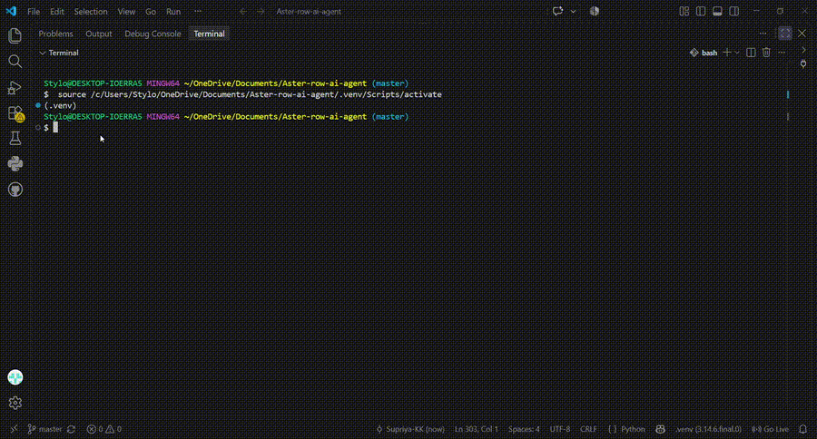

# Aster & Row AI Customer Support Agent

A small Python customer support agent built for the Aster & Row take-home assignment.

The agent uses the supplied knowledge-base documents to answer customer questions and uses the mock order data when an order ID is provided.

## Features

* Answers customer questions using the supplied knowledge base
* Uses RAG-style retrieval instead of sending the whole knowledge base to the model
* Gives source references for retrieved policy information
* Looks up order information from `data/orders.json`
* Handles order follow-up questions
* Handles unknown and malformed order IDs
* Avoids exposing internal order information
* Does not invent information when the knowledge base does not contain an answer
* Handles conflicting or unsafe retrieved content
* Includes automated tests and an evaluation suite

## Technologies

* Python
* Google Gemini API
* RAG-style retrieval using TF-IDF
* JSON
* Pytest
* Git and GitHub

## Model and Storage

**Model:** Google Gemini `gemini-3.6-flash`

**Retrieval:** TF-IDF based text retrieval using `scikit-learn`.

The Markdown files in `knowledge-base/` are split into smaller sections and searched using relevant words from the customer's question.

**Storage:** Local Markdown files for the knowledge base and a local JSON file for mock order data.

**Framework:** The application is a small Python application without a large agent framework.

## Architecture

The project is mainly divided into three parts:

* `rag.py` handles searching the knowledge-base files and finding relevant information.
* `orders.py` handles looking up orders from `orders.json`.
* `agent.py` takes the customer question, uses the relevant information, and generates the final response.

`main.py` is used to run a few sample questions and see the agent working.

For normal questions, the agent searches the knowledge base first. If an order ID is included, it looks up that order and uses the order result in the response.

The basic flow is:

```text
Customer question
       ↓
     Agent
       ↓
Knowledge base / Order lookup
       ↓
Relevant information
       ↓
Gemini
       ↓
Final answer
```

## Project Structure

```text
aster-row-ai-agent/
├── data/
├── evaluation/
│   ├── visible-cases.json
│   └── run_evaluation.py
├── knowledge-base/
├── src/
│   ├── agent.py
│   ├── orders.py
│   └── rag.py
├── tests/
├── demo/
│   └── agent-demo.mp4
├── main.py
├── requirements.txt
├── .env.example
└── README.md
```

## Setup

Clone the repository:

```bash
git clone https://github.com/Supriya-KK/aster-row-ai-agent.git
cd aster-row-ai-agent
```

Create a virtual environment:

```bash
python -m venv .venv
```

Activate it on Windows:

```bash
source .venv/Scripts/activate
```

Install dependencies:

```bash
pip install -r requirements.txt
```

Create a `.env` file using `.env.example` and add a Gemini API key:

```text
GEMINI_API_KEY=your_api_key_here
```

Do not commit the `.env` file or any real API key.

## Run the Agent

The current demo entry point is:

```bash
python main.py
```

`main.py` contains a few example customer questions so the application can be demonstrated without a separate frontend.

The application can also be imported and used through the `answer_question()` function in `src/agent.py`.

## Example

```text
Customer: Where is order ORD-1001?

Agent: We received the order and it has not entered processing yet.
```

```text
Customer: What is the standard return window?

Agent: The standard return window is 30 calendar days from delivery.
```

When the required information is not available, the agent should avoid guessing and instead explain that it does not have enough information.

## Testing

Run the automated tests:

```bash
pytest -q
```

Latest test result:

```text
18 passed, 1 warning
```

The warning comes from a dependency used by the Google GenAI package and does not cause the tests to fail.

## Evaluation

Run the evaluation suite with:

```bash
python evaluation/run_evaluation.py
```

The evaluation checks the supplied visible cases and reports results by category.

### Baseline

The first evaluation run showed problems with policy retrieval and some order handling.

```text
12/15 cases passed
```

The main problems found included:

* TrailPlus information was not always retrieved
* International shipping questions were sometimes treated as insufficient information
* Some order responses did not match the expected wording
* Some evaluation cases were affected by Gemini API quota

### Final Evaluation

After the retrieval decision was improved, the evaluation reached:

```text
Passed: 8
Failed: 4
Model unavailable: 3
Total: 15
```

The three `MODEL_UNAVAILABLE` cases were caused by Gemini API quota being unavailable during those evaluation runs.

The four remaining failures were also affected by model availability in later manual checks. The application retrieval itself returned the expected source documents for those cases.

The deterministic application test suite remained:

```text
18 passed
```

## Bug Diary

### 1. Policy questions containing "order" skipped RAG

**How it was reproduced:**

A TrailPlus question such as:

```text
My TrailPlus membership was active when I ordered. What is my return window?
```

was incorrectly treated as an order question.

**Root cause:**

The agent originally decided that a question was an order question when it contained words such as `order`, `delivery`, or `shipment`.

**Fix:**

The application now uses the presence of a valid order ID to decide whether an order lookup is required.

**Regression test:**

The existing test suite and the `trailplus-return-window` evaluation case cover this behavior.

### 2. Unknown order handling

**How it was reproduced:**

```text
Please check ORD-9999.
```

The evaluation checked that the system did not invent a status or delivery estimate.

**Root cause:**

The order lookup result needed to be used directly for unknown orders instead of allowing the model to make assumptions.

**Fix:**

Unknown orders now return a safe "could not find order" response without inventing order details.

**Regression test:**

The `unknown-order` evaluation case and automated order tests cover this behavior.

### 3. Orders without delivery estimates

**How it was reproduced:**

```text
When will ORD-1011 get here?
```

The order is shipped with Canada Post but has no delivery estimate.

**Root cause:**

The agent could potentially try to provide an arrival date even when the order data did not contain one.

**Fix:**

The sanitized order result is used directly and the response states that a delivery estimate is not currently available.

**Regression test:**

The `shipped-without-eta` evaluation case covers this behavior.

## Safety and Privacy

The agent does not expose internal order fields such as:

* customer email
* customer address
* internal notes
* risk scores

The model is also instructed not to reveal system instructions, secrets, or internal-only information.

Retrieved knowledge-base content is treated as untrusted data and is not allowed to override the application's instructions.

## Known Limitations

* The order data is stored locally in JSON.
* Order cancellation is not actually implemented.
* The application currently uses a simple TF-IDF retrieval approach rather than a production vector database.
* The Gemini API is required for model-generated policy answers.
* API quota or availability can affect evaluation results.
* The current interface is a simple command-line demonstration rather than a web application.
* Conversation memory is kept in the current Python process and is not persistent between sessions.
* More work would be needed for production monitoring, authentication, persistent storage, and stronger retrieval evaluation.

## AI Coding Tools

AI coding assistance was used during development for:

* explaining Python and RAG concepts
* debugging Python errors
* suggesting small code changes
* improving test and evaluation logic
* checking Git commands and project structure

One example of an incomplete AI suggestion was treating questions containing words such as `order` or `delivery` as order-specific questions. This caused legitimate policy questions, such as TrailPlus return questions, to skip knowledge-base retrieval. The logic was changed so that an actual order ID is required before performing order-specific handling.

## Demo

The following demo shows the Aster & Row AI customer support agent working with customer questions, order lookup, multi-turn behavior, safe responses, and the evaluation suite.

<p align="center">
  
</p>

[▶️ Watch the full demo video](demo/agent-demo.mp4)

## Final Notes

This project focuses on building a small system that is reliable for the supplied customer-support scenarios rather than building a large production platform.
